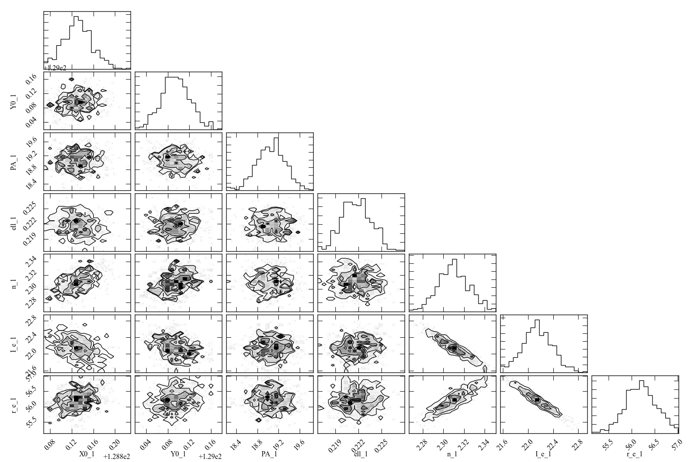

Bootstrap Resampling for Parameter Uncertainties
================================================

When you call the ``doFit`` method on an Imfit object with the default
Levenberg-Marquardt solver, the solution automatically involves
estimation of uncertainties on the best-fit parameters, in the form of
1-sigma Gaussian errors. These are generally not very accurate (they
assume the fit-statistic landscape is quadratic) and do not include
possible correlations between uncertainties in different parameters.

Bootstrap Resampling
--------------------

A somewhat better (albeit more time-consuming) approach is to estimate
the parameter uncertainties – including possible correlations between
the values of different parameters – via bootstrap resampling.

You can do this by calling the ``runBootstrap`` method on an Imfit
object – ideally *after* you’ve found a best-fit solution. E.g.,
assuming you’ve properly set up an Imfit object (“``imfitter``”) and
supplied it with the data image, etc.:

::

   imfitter.doFit()
   bootstrapResults = imfitter.runBootstrap(nIterations)

where ``nIterations`` is an integer specifying the total number of
iterations (ideally a minimum of several hundred).

This returns a 2D NumPy array which has one row per iteration, with each
column contain the collected values for a single parameter. The ordering
of the parameter columns is the same as in the model.

You can get a list of numbered parameter names by using the
``getColumnNames`` keyword:

::

   parameterNames, bootstrapResults = imfitter.runBootstrap(nIterations, getColumnNames=True)

``parameterNames`` is a list of strings of the form [‘X0_1’, ‘Y0_1’,
‘n_1’, etc.]. The ‘X0’,‘Y0’ parameters are numbered by function set; all
other parameters are numbered by function (so the parameters of the very
first function in the model have ’_1’ appended to their names, all
parameters from the second will have ``_2`` appended, and so forth).
This is make it possible to distinguish different parameters when
multiple versions of the same function, or just multiple functions that
have the same parameter names, are used in the model. (This numbering
scheme is exactly the same as used by the command-line program ``imfit``
in its bootstrap-output files.)

Analyzing the Results
~~~~~~~~~~~~~~~~~~~~~

One thing you can do, if the model is not *too* complicated, is make a
scatterplot matrix (a.k.a. corner plot) of the parameters. The Python
package `corner.py <https://corner.readthedocs.io/en/latest/>`__ can be
used for this; here’s a quick-and-dirty example:

::

   import corner

   corner.corner(bootstrapResults, labels=parameterNames)

A sample result is shown below (see the `Imfit
tutorial <https://www.mpe.mpg.de/~erwin/code/imfit/markdown/index.html>`__
for more about the data and model used to generate this figure).

**Figure 1:** Scatterplot matrix of parameter values from 500 rounds of
bootstrap resampling fits to an SDSS *r*-band image of the galaxy IC
3478 (single-Sérsic model, no PSF convolution). Note the clear
correlations between the Sérsic model parameters (*n*, *r_e*, *I_e*).

See `here <./pyimfit_bootstrap_BtoT.html>`__ for an example of using
bootstrap output to estimate uncertainties on derived quantities, such
as bulge/total values.

.. raw:: html

   

Using MCMC
----------

Estimates of parameter uncertainties and correlations can also be
obtained via Markov-Chain Monte Carlo (MCMC) approaches. Although the
MCMC option of **Imfit** (``imfit-mcmc``) is not part of PyImfit, you
*can* use instances of the Imfit class with Python-based MCMC codes,
such as `emcee <https://github.com/dfm/emcee>`__; see
`here <./pyimfit_emcee.html>`__ for an example.
