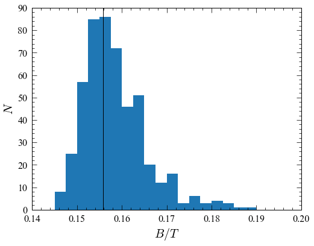

Example of using PyImfit to Estimate B/T Uncertainties
======================================================

This is a Jupyter notebook demonstrating how to use PyImfit and
bootstrap resampling to estimate uncertainties for derived quantities of
fits, such as :math:`B/T` values.

If you are seeing this as part of the readthedocs.org HTML
documentation, you can retrieve the original .ipynb file
`here <https://github.com/perwin/pyimfit/blob/master/docs/pyimfit_bootstrap_BtoT.ipynb>`__.

Introduction
------------

PyImfit will estimate uncertainties for individual model parameters from
a fit (if you use the default Levenberg-Marquardt minimizer) – e.g.,
position :math:`X0,Y0`, position-angles, ellipticities, scale lengths,
etc.. You can also estimate parameter uncertainties via bootstrap
resampling, or by using an external Markov-Chain Monte Carlo algorithm
(see `here <./pyimfit_emcee.html>`__ for an example of the latter).

Sometimes, you might also want to have some estimate of derived values
based on a model, such as the total luminosity or the bulge/total
(:math:`B/T`) value (assuming you have some idea of which component in
your model is the “bulge”). How do you determine the uncertainties for
such quantities? This notebook shows a simple example of how one might
do that, using PyImfit’s bootstrap-resampling option.

The basic idea is to generate a set of model-parameter vectors via,
e.g., bootstrap resampling (or from an MCMC chain). You then compute the
resulting derived quantity from those parameter values. In this
particular case, we use the ``pyimfit.Imfit`` object containing the
model to compute “bulge” and total flux values for each parameter
vector, and then take the ratio to get :math:`B/T` values. By doing this
for all the parameter vectors, you end up with a distribution for the
derived quantity.

**Preliminaries**

Some initial setup for nice-looking plots:

.. code:: python

   %pylab inline

   matplotlib.rcParams['figure.figsize'] = (8,6)
   matplotlib.rcParams['xtick.labelsize'] = 16
   matplotlib.rcParams['ytick.labelsize'] = 16
   matplotlib.rcParams['axes.labelsize'] = 20

::

   Populating the interactive namespace from numpy and matplotlib

Create an image-fitting model using PyImfit
~~~~~~~~~~~~~~~~~~~~~~~~~~~~~~~~~~~~~~~~~~~

Load the pymfit package; also load numpy and astropy.io.fits (so we can
read FITS files):

.. code:: python

   import numpy as np
   import pyimfit
   from astropy.io import fits

Load the data image (here, an SDSS :math:`r`-band image cutout of VCC
1512) and corresponding mask:

.. code:: python

   imageFile = "./pyimfit_bootstrap_BtoT_files/vcc1512rss_cutout.fits"
   image_vcc1512 = fits.getdata(imageFile)
   maskFile = "./pyimfit_bootstrap_BtoT_files/vcc1512rss_mask_cutout.fits"
   mask_vcc1512 = fits.getdata(maskFile)

Create a ModelDescription instance based on an imfit configuration file
(which specifies a Sersic + Exponential model):

.. code:: python

   configFile = "./pyimfit_bootstrap_BtoT_files/config_imfit_vcc1512.dat"
   model_desc = pyimfit.ModelDescription.load(configFile)

.. code:: python

   print(model_desc)

::

   ORIGINAL_SKY    120.020408
   GAIN    4.725000
   READNOISE   4.300000
   X0      60.0
   Y0      73.0
   FUNCTION Sersic
   PA      155.0       90.0,180.0
   ell     0.2     0.0,0.5
   n       2.05        0.0,4.0
   I_e     120.0       0.0,10000.0
   r_e     4.5     0.0,20.0

   FUNCTION Exponential
   PA      140.0       90.0,180.0
   ell     0.28        0.0,0.8
   I_0     70.0        0.0,10000.0
   h       20.0        0.0,200.0

Create an Imfit instance containing the model, and add the image and
mask data. Note that we are *not* doing PSF convolution, in order to
save time (this is not meant to be a particular accurate model).

.. code:: python

   imfit_fitter = pyimfit.Imfit(model_desc)
   imfit_fitter.loadData(image_vcc1512, mask=mask_vcc1512)

Fit the model to the data (using the default Levenberg-Marquardt solver)
and extract the best-fitting parameter values:

.. code:: python

   results = imfit_fitter.doFit(getSummary=True)

.. code:: python

   print(results)

::

               aic: 21156.824446201397
               bic: 21242.642276390998
      fitConverged: True
           fitStat: 21134.809840392267
    fitStatReduced: 1.169219398118625
             nIter: 10
         paramErrs: array([0.01518161, 0.0167467 , 1.88166351, 0.00733777, 0.01613089,
          1.9553319 , 0.05896027, 0.65080573, 0.00529781, 1.11196358,
          0.18740197])
            params: array([6.04336387e+01, 7.32059007e+01, 1.61799952e+02, 1.18947666e-01,
          9.56352657e-01, 1.21814611e+02, 4.86558532e+00, 1.38986928e+02,
          2.73912311e-01, 8.13853830e+01, 2.08521933e+01])
        solverName: 'LM'

.. code:: python

   p_bestfit = results.params

   print("Best-fitting parameter values:")
   for i in range(len(p_bestfit) - 1):
       print("{0:g}".format(p_bestfit[i]), end=", ")
   print("{0:g}\n".format(p_bestfit[-1]))

::

   Best-fitting parameter values:
   60.4336, 73.2059, 161.801, 0.118946, 0.956308, 121.821, 4.86538, 138.987, 0.273911, 81.389, 20.8517

Run bootstrap-resampling to generate a set of parameter values (array of best-fit parameter vectors)
~~~~~~~~~~~~~~~~~~~~~~~~~~~~~~~~~~~~~~~~~~~~~~~~~~~~~~~~~~~~~~~~~~~~~~~~~~~~~~~~~~~~~~~~~~~~~~~~~~~~

OK, now we’re going to do some bootstrap resampling to build up a set of
several hundred alternate “best-fit” parameter values.

Note that you coul also generate a set of parameter vectors using MCMC;
we’re doing bootstrap resampling mainly because it’s faster.

Run 500 iterations of bootstrap resamplng. More would be better; this is
just to save time (takes about 1 minute on a 2017 MacBook Pro).

.. code:: python

   bootstrap_params_array = imfit_fitter.runBootstrap(500)

.. code:: python

   bootstrap_params_array.shape

::

   (500, 11)

Use these parameter vectors to calculate range of B/T values
~~~~~~~~~~~~~~~~~~~~~~~~~~~~~~~~~~~~~~~~~~~~~~~~~~~~~~~~~~~~

We define a function to calculate the :math:`B/T` value, given a
parameter vector (for this model it’s simple, but you might have a more
complicated model where the first component isn’t necessarily the
“bulge”).

.. code:: python

   def GetBtoT( fitter, params ):
       """
       Get the B/T value for a model parameter vector (where "bulge" is the first component
       in the model)
       
       Parameters
       ----------
       fitter : instance of PyImfit's Imfit class
           The Imfit instance containing the model and data to be fit
       params : 1D sequence of float
           The parameter vector corresponding to the model
       
       Returns
       -------
       B/T : float
       """
       total_flux, component_fluxes = fitter.getModelFluxes(params)
       # here, we assume the first component in the model is the "bulge"
       return component_fluxes[0] / total_flux

The :math:`B/T` value for the best-fit model:

.. code:: python

   GetBtoT(imfit_fitter, p_bestfit)

::

   0.1557485598370547

Now calculate the :math:`B/T` values for the bootstrap-generated set of
parameter vectors:

.. code:: python

   n_param_vectors = params_array.shape[0]
   b2t_values = [GetBtoT(imfit_fitter, bootstrap_params_array[i]) for i in range(n_param_vectors)]
   b2t_values = np.array(b2t_values)

And now we can analyze the vector of B/T values …

For example:

.. code:: python

   np.mean(b2t_values)

::

   0.15852423639167879

A histogram of the :math:`B/T` values (vertical line = best-fit value):

.. code:: python

   hist(b2t_values, bins=np.arange(0.14,0.2,0.0025));xlabel(r"$B/T$");ylabel(r"$N$")
   axvline(GetBtoT(imfit_fitter, p_bestfit), color='k')

::

   <matplotlib.lines.Line2D at 0x12c671a10>

   png
