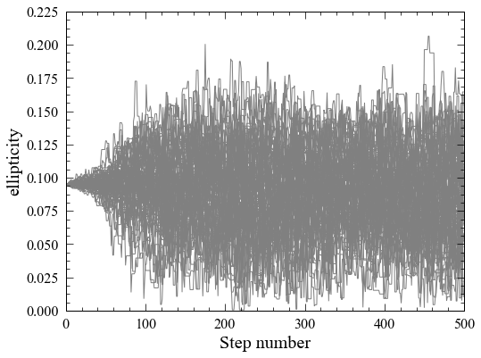
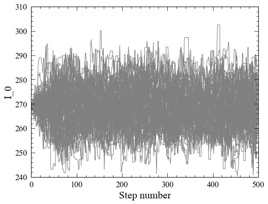
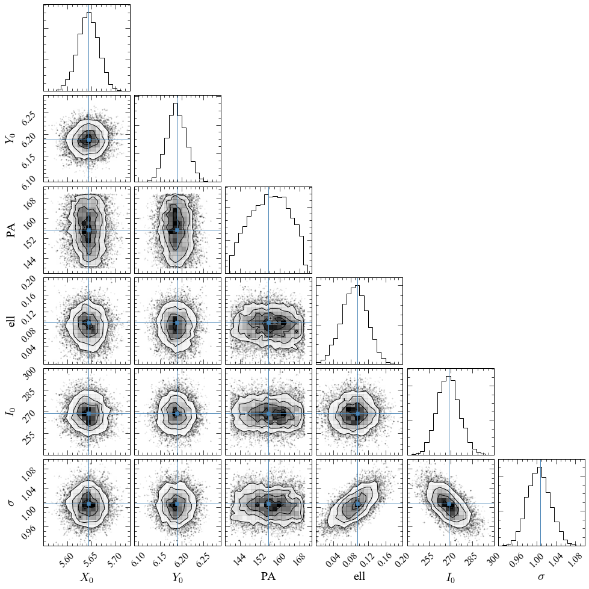

Example of using PyImfit with Markov-Chain Monte Carlo code “emcee”
===================================================================

This is a Jupyter notebook demonstrating how to use PyImfit with the
MCMC code `emcee <https://github.com/dfm/emcee>`__.

If you are seeing this as part of the readthedocs.org HTML
documentation, you can retrieve the original .ipynb file
`here <https://github.com/perwin/pyimfit/blob/master/docs/pyimfit_emcee.ipynb>`__.

Some initial setup for nice-looking plots:

.. code:: python

   %pylab inline

   matplotlib.rcParams['figure.figsize'] = (8,6)
   matplotlib.rcParams['xtick.labelsize'] = 16
   matplotlib.rcParams['ytick.labelsize'] = 16
   matplotlib.rcParams['axes.labelsize'] = 20

::

   Populating the interactive namespace from numpy and matplotlib

   /Library/Frameworks/Python.framework/Versions/3.7/lib/python3.7/site-packages/IPython/core/magics/pylab.py:160: UserWarning: pylab import has clobbered these variables: ['mean']
   `%matplotlib` prevents importing * from pylab and numpy
     "\n`%matplotlib` prevents importing * from pylab and numpy"

Create image-fitting model using PyImfit
~~~~~~~~~~~~~~~~~~~~~~~~~~~~~~~~~~~~~~~~

Load the pymfit package; also load astropy.io.fits so we can read FITS
files:

.. code:: python

   import pyimfit
   from astropy.io import fits

Load data image (in this case, a small cutout of an SDSS image showing a
faint star):

.. code:: python

   imageFile = "./pyimfit_emcee_files/faintstar.fits"
   image_faintstar = fits.getdata(imageFile)

Create a ModelDescription instance based on an imfit configuration file
(which specifies a single elliptical Gaussian model):

.. code:: python

   configFile = "./pyimfit_emcee_files/config_imfit_faintstar.dat"
   model_desc = pyimfit.ModelDescription.load(configFile)

Alternately, you can create the ModelDescription programmatically from
within Python:

.. code:: python

   # create a SimpleModelDescription instance (one function block); specify the x0,y0 center for the function block.
   model_desc = pyimfit.SimpleModelDescription()
   # define the X0,Y0 initial guess and limits
   model_desc.x0.setValue(5.0, [3.0,8.0])
   model_desc.y0.setValue(6.0, [3.0,8.0])
   # create a Gaussian image function for the star and set its parameters' initial guesses and limits
   star_function = pyimfit.make_imfit_function("Gaussian")
   star_function.PA.setValue(155, [140,170])
   star_function.ell.setValue(0.1, [0,0.3])
   star_function.I_0.setValue(250, [220,320])
   star_function.sigma.setValue(1.0, [0.1,1.5])
   # now add the image function to the model
   model_desc.addFunction(star_function)

Create an Imfit instance containing the model, and add the image data
and image-description info:

.. code:: python

   imfit_fitter = pyimfit.Imfit(model_desc)
   imfit_fitter.loadData(image_faintstar, gain=4.72, read_noise=1.15, original_sky=124.94)

Fit the model to the data (using the default Levenberg-Marquardt solver)
and extract the best-fitting parameter values (X0, Y0, PA, ellipticity,
I_0, sigma):

.. code:: python

   results = imfit_fitter.doFit(getSummary=True)
   p_bestfit = results.params

   print("Best-fitting parameter values:")
   for i in range(len(p_bestfit) - 1):
       print("{0:g}".format(p_bestfit[i]), end=", ")
   print("{0:g}\n".format(p_bestfit[-1]))

::

   Best-fitting parameter values:
   5.64339, 6.18794, 155.354, 0.0950157, 268.92, 1.00772

Define log-probability functions for use with emcee
~~~~~~~~~~~~~~~~~~~~~~~~~~~~~~~~~~~~~~~~~~~~~~~~~~~

Emcee requires a function which calculates and returns the log of the
posterior probability (using the likelihood and the prior probability).

We’ll create a general function for this which takes as input the
current model parameters, an Imfit instance which can compute the fit
statistic for those parameters (= :math:`-2 \: \times` log likelihood)
and a user-supplied function for computing the prior; this will return
the sum of the log likelihood and the log of the prior:

.. code:: python

   def lnPosterior_for_emcee( params, imfitter, lnPrior_func ):
       """
       Returns log of posterior probability (which is calculated as the
       product of the specified prior and the likelihood computed by the
       Imfit object using the specified parameter values).
       
       Parameters
       ----------
       params : 1D numpy ndarray of float
           vector of current parameter values
       
       imfitter : pyimfit.Imfit instance
       
       lnPrior_func : function or other callable
           Should compute and return log of prior probability
           signature = lnPrior_func(parameter_vector, Imfit_instance)
       
       Returns
       -------
       logPosterior : float
       """
       lnPrior = lnPrior_func(params, imfitter)
       if not np.isfinite(lnPrior):
           return -np.inf
       # note that Imfit.computeFitStatistic returns -2 log(likelihood)
       lnLikelihood = -0.5 * imfitter.computeFitStatistic(params)
       return lnPrior + lnLikelihood

Now, we’ll create a prior-probability function.

For simplicity, we’ll use the case of constant priors within parameter
limits, with the parameter limits obtained from a user-supplied Imfit
instance. (But you can make the prior-probability function as
complicated as you like.)

.. code:: python

   def lnPrior_limits( params, imfitter ):
       """
       Defines prior-probability distributions as flat within specified limits.
       If any parameter is outside the limits, we return -np.inf; otherwise, we
       return ln(1.0) = 0 (not strictly speaking a correct probability, but it
       works for this case).
       
       Parameters
       ----------
       params : 1D numpy ndarray of float
       
       imfitter : pyimfit.Imfit instance
       
       Returns
       -------
       logPrior : float
       """
       parameterLimits = imfitter.getParameterLimits()
       if None in parameterLimits:
           raise ValueError("All parameters must have lower and upper limits.")
       nParams = len(params)
       for i in range(nParams):
           if params[i] < parameterLimits[i][0] or params[i] > parameterLimits[i][1]:
               return -np.inf
       return 0.0

Set up and run Markov-Chain Monte Carlo using emcee
~~~~~~~~~~~~~~~~~~~~~~~~~~~~~~~~~~~~~~~~~~~~~~~~~~~

Import `emcee <https://emcee.readthedocs.io/en/latest/>`__, and also
`corner <https://corner.readthedocs.io/en/latest/>`__ (so we can make a
nice plot of the results):

.. code:: python

   import emcee
   import corner

Specify the number of dimensions (= number of parameters in the model)
and a large number of walkers, then instantiate a standard emcee
sampler, using our previously defined posterior function (the Imfit
instance containing the data and model and the simple prior function are
provided as extra arguments):

.. code:: python

   ndims, nwalkers = 6, 100

   sampler = emcee.EnsembleSampler(nwalkers, ndims, lnPosterior_for_emcee, args=(imfit_fitter, lnPrior_limits))

Define some initial starting values – 0.1% Gaussian perturbations around
the previously determined best-fit parameters:

.. code:: python

   initial_pos = [p_bestfit * (1 + 0.001*np.random.randn(ndims)) for i in range(nwalkers)]

Run the sampler for 500 steps (reset it first, in case we’re running
this again, to ensure we start anew):

.. code:: python

   sampler.reset()
   final_state = sampler.run_mcmc(initial_pos, 500)

Plot values from all the walkers versus step number to get an idea of
where convergence might happend (here, we just plot the ellipticity and
I_0 values):

.. code:: python

   def PlotAllWalkers( sample_chain, parameterIndex, yAxisLabel ):
       nWalkers = sample_chain.shape[0]
       for i in range(nWalkers):
           plot(sample_chain[i,:,parameterIndex], color='0.5')
       xlabel('Step number')
       ylabel(yAxisLabel)

   PlotAllWalkers(sampler.chain, 3, 'ellipticity')

   png

.. code:: python

   PlotAllWalkers(sampler.chain, 4, 'I_0')

   png

Define the “converged” subset of the chains as step numbers
:math:`\ge 200`, and merge all the individual walkers:

.. code:: python

   converged_samples = sampler.chain[:, 200:, :].reshape((-1, ndims))
   print("Number of samples in \"converged\" chain = {0}".format(len(converged_samples)))

::

   Number of samples in "converged" chain = 30000

Corner plot of converged MCMC samples
~~~~~~~~~~~~~~~~~~~~~~~~~~~~~~~~~~~~~

Define some nice labels and parameter ranges for the corner plot:

.. code:: python

   cornerLabels = [r"$X_{0}$", r"$Y_{0}$", "PA", "ell", r"$I_{0}$", r"$\sigma$"] 

   x0_range = (5.55, 5.73)
   y0_range = (6.09, 6.29)
   pa_range = (138,173)
   ell_range = (0, 0.2)
   i0_range = (240,300)
   sigma_range = (0.92, 1.1)
   ranges = [x0_range, y0_range, pa_range, ell_range, i0_range, sigma_range]

Make a corner plot; the thin blue lines/points indicate best-fit values
from above. [Note that we have to explicitly capture the Figure instance
returned by corner.corner, otherwise we’ll get a duplicate display of
the plot]:

.. code:: python

   fig = corner.corner(converged_samples, labels=cornerLabels, range=ranges, truths=p_bestfit)

   png

One thing to notice is that the PA values are running up against our
(rather narrow) limits for that parameter, so a next step might be to
re-run this with larger PA limits.
